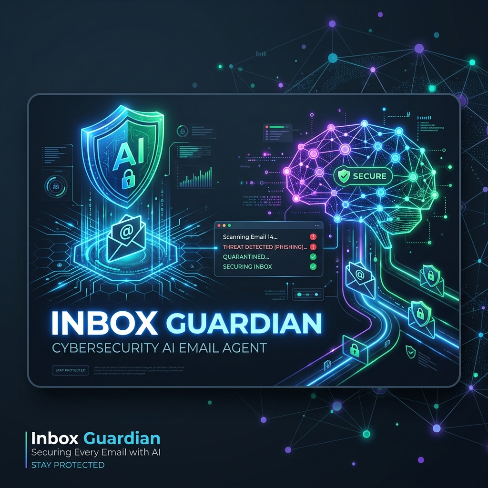
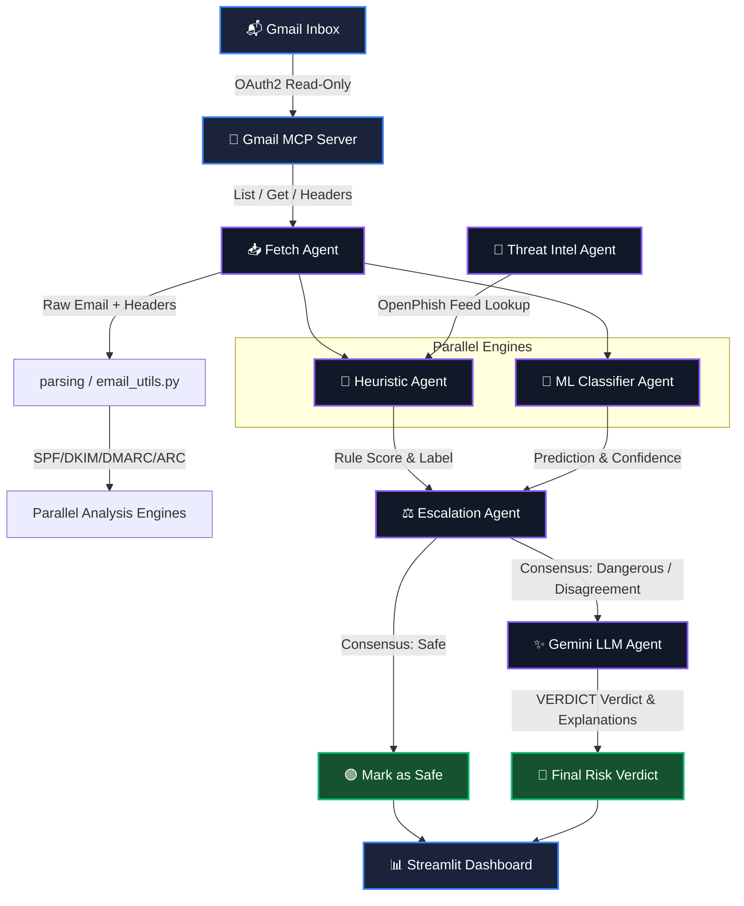

# Inbox Guardian 🛡️



> **AI-powered email threat detection for your Gmail inbox.**
> <br>Built by **Team Sentinel** · *AI Agents: Intensive Vibe Coding Capstone Project*

Live Demo : https://inboxguardian-rj8y.onrender.com

> [!IMPORTANT]
> **Note for judges:** This app connects to Gmail, so sign-in is currently
> limited to approved test accounts (Google's OAuth testing-mode restriction).
>
> - **Want to sign in with your own account?** Contact us (**v.abhiramreddy2007@gmail.com** or **haricharankanukuntla@gmail.com**) and we'll add you as a test user — usually takes a few minutes.
> - **Want to explore right away?** Use **[Demo Mode](https://inboxguardian-rj8y.onrender.com/?demo=1)** — no sign-in required, preloaded with sample emails across every category (safe, spam, scam, phishing).

Inbox Guardian is a multi-agent email security platform that combines fast rule-based heuristics, a trained ML classifier, and Google Gemini LLM deep-analysis to detect phishing, scams, and spam in real-time — directly in your browser via a Streamlit dashboard.

---

## ⚠️ The Problem

Every day, over **3.4 billion phishing emails** are sent globally, representing a primary vector for financial fraud, credential harvesting, and malware delivery. Standard email clients and spam filters fall short because:
- **Lookalike Domains & Spoofing:** Attackers use advanced typosquatting and local-part spoofing that bypass classic domain checks.
- **Psychological Manipulation:** Phishing relies on urgent language, fear, or false rewards that rule-based systems struggle to flag.
- **The Explainability Deficit:** Traditional security tools label an email as "spam" or "phishing" without explaining *why*, leaving users to guess the threat vector.
- **Cost & Quota Limits:** Querying a large language model (LLM) for every single incoming email is slow, expensive, and rate-limited.

## 💡 The Solution: Inbox Guardian

Inbox Guardian is a hybrid multi-agent email security system built on a **defense-in-depth** model. By dividing detection tasks among specialized agents, it provides real-time, high-accuracy threat classification with explainable AI summaries.

- **Consensus & Escalation:** Fast, zero-latency local rule engines and machine learning models process emails first. The Google Gemini LLM is only called as a tiebreaker when engines disagree (e.g. Heuristics and ML disagree, or confidence is low), saving quota and minimizing latency.
- **Explainable Verdicts:** Instead of raw scores, Gemini generates plain-language, jargon-free explanations detailing the precise threat indicators found.

---

## 🤖 Agent Pipeline

Inbox Guardian is composed of **6 specialized agents** working together in a pipeline:

| Agent | File | Role |
|---|---|---|
| 📥 **Gmail Fetch Agent** | `agents/connector_agent.py` | Authenticates via OAuth2 and fetches email stubs & full bodies from the Gmail API |
| 🔍 **Heuristic Scoring Agent** | `agents/scoring_agent.py` | Rule-based engine scoring emails 0–100 across sender, links, language, and attachment signals |
| 🧠 **ML Classifier Agent** | `agents/ml_classifier_agent.py` | RandomForest model predicting threat category and confidence score |
| 🤖 **Gemini LLM Agent** | `agents/llm_analysis_agent.py` | Google Gemini reads email content and generates plain-language threat explanations |
| ⚡ **Escalation Agent** | `dashboard/app.py` | Detects Safe↔Risky disagreements between engines and routes to the LLM tiebreaker |
| 📡 **Threat Intel Agent** | `dashboard/app.py` | Aggregates live threat feeds, breach data, and trending phishing campaign indicators |

### 📊 System Architecture & Data Flow



---

## ✨ Features

### 🔍 Real-Time Inbox Analysis
- Fetches your last **10 Gmail messages** via OAuth (expandable with **Load More**)
- Progressive loading — inbox appears row-by-row as analysis runs
- Live progress bar showing fetch, scoring, and LLM analysis stages

### ⚡ Heuristic Scoring Engine
Fast, zero-latency local scoring across 4 signal categories:

| Category | Signals Detected |
|---|---|
| **Sender** | Display name/local-part spoofing, domain mismatch, lookalike/typosquatted domains, failed authentication |
| **Links** | Brand impersonation via URL mismatch, URL shorteners, live threat feed lookups (OpenPhish) |
| **Language** | Urgency & threat phrases, credential/payment requests, too-good-to-be-true offers |
| **Attachments** | Suspicious attachment language, dangerous file extensions, macro enable requests |

Scoring returns a **0–100 risk score** and classifies each email as: `safe`, `spam`, `scam`, or `phishing`.

### 🤖 Gemini AI Deep Analysis
- **Threshold-based:** Only non-safe emails (spam/scam/phishing) trigger a Gemini call (saves quota)
- **Disagreement escalation:** If the Heuristic engine and ML model disagree (one says Safe, the other says Risky with ≥50% confidence), Gemini is called as an authoritative **tiebreaker**
- **Structured verdict:** In tiebreaker mode, Gemini emits a parseable `VERDICT: safe|spam|scam|phishing` line — the dashboard badge and score are overridden to match Gemini's final decision
- Plain-language output (no jargon) — results shown in 2–3 concise sentences
- Hardened against **prompt injection** — email body is sandboxed in `<EMAIL_BODY>` XML tags
- Result caching (`llm_cache.json`) prevents redundant API calls for already-seen emails
- **Automatic model fallback chain:** `gemini-3.5-flash → 3.5-flash-lite → 2.5-pro → 2.5-flash → 2.5-flash-lite → 2.0-pro-exp → 2.0-flash → 2.0-flash-lite`

### 🔐 Universal Sender Trust & ARC Support
- **Protocol-driven trust** — any sender passing SPF + DKIM + DMARC gets a score reduction
- **Mailing list forwarding support** — DKIM + ARC pass is recognized as valid forwarding even when SPF soft-fails (e.g., Google Groups, university mailing lists)
- **Institutional TLD heuristics** — `.edu`, `.gov`, `.ac.in`, `.gov.in`, `.nic.in` receive extra trust credit
- **Smart TLD handling** — modern brand TLDs (`.io`, `.events`, `.tech`, `.app`) are NOT flagged as typosquatting unless a specific brand is clearly being impersonated

### 🧠 ML Classifier
- **RandomForest Model** trained on real SpamAssassin ham/spam archives and the Nazario phishing corpus
- **Features:** TF-IDF text vectorization combined with structural features (link counts, keyword frequencies, lookalike domains)
- **Zero-Leakage Evaluation:** Dataset strictly deduplicated before train/test split

### 📊 Streamlit Dashboard
- **9 navigation tabs:** Dashboard, Email Analysis, Threat Intel, Link Scanner, Scam Detector, User Reports, Analytics, Settings, **About**
- Filtering by risk category and minimum risk score
- Per-email expandable detail view with heuristic signals and Gemini explanation
- **Demo mode** (`?demo=1`) — uses `results-demo.json` sample data, no login required
- **Load More** button to fetch additional emails in batches of 10
- Model disagreement transparency trail: shows Rule Engine vs ML vs Gemini verdict on each card

### 🛡️ Security Hardening
- All secrets loaded from **environment variables only** — no hardcoded keys anywhere
- Structured `logging` throughout — no `print()` statements or raw tracebacks exposed to users
- OAuth token exchange happens server-side; tokens never exposed to the UI or logs
- Atomic cache writes to prevent partial/corrupt JSON files
- HTTPS-only production URLs enforced
- **XSS protection** — all user-submitted content (scam reports) is HTML-escaped before rendering
- **Prompt injection hardening** — email body sandboxed in `<EMAIL_BODY>` XML tags; Gemini system prompt explicitly rejects any instructions found inside email content

### 🧪 Testing
- **17 unit tests** across `scoring_agent.py` and `email_utils.py`
- **14 regression tests** with fictional domains to verify universal trust logic
- False-positive coverage: institutional (.ac.in, .gov.in, .edu), small orgs, mailing lists
- True-positive coverage: phishing, lottery scams, BEC, fake HR recruitment emails

---

## 🗂️ Project Structure

```
InboxGuardian/
├── agents/
│   ├── scoring_agent.py        # Heuristic scoring engine (0–100 score, 4 signal categories)
│   ├── llm_analysis_agent.py   # Gemini LLM deep analysis + verdict parsing
│   ├── ml_classifier_agent.py  # RandomForest ML classifier (predict_category)
│   ├── connector_agent.py      # Gmail API connector
│   ├── email_utils.py          # Email parsing utilities (ARC, SPF, DKIM, DMARC)
│   └── audit_log.py            # Structured audit logging
├── mcp-server/
│   ├── gmail_mcp_server.py     # Gmail MCP tool server (multi-hop ARC aware)
│   └── gmail_auth.py           # OAuth 2.0 flow and token management
├── ml/
│   ├── collect_data.py         # Downloads/parses Nazario & SpamAssassin datasets
│   ├── feature_engineering.py  # Builds TF-IDF & structural features (zero-leakage)
│   ├── train_model.py          # Trains the RandomForest classifier
│   └── evaluate.py             # Generates evaluation report & hard-case tests
├── dashboard/
│   └── app.py                  # Streamlit web dashboard (9 tabs, full agent pipeline)
├── utils/
│   └── cache_utils.py          # Atomic JSON read/write and cache key generation
├── tests/
│   └── run_local_tests.py      # Zero-dependency unit + regression test runner
├── results-demo.json           # Sample data for demo mode
├── requirements.txt
└── Dockerfile
```

---

## 🚀 Getting Started

### Prerequisites
- Python 3.11+
- A Google Cloud project with Gmail API enabled
- `GEMINI_API_KEY` environment variable set

### Installation

```bash
git clone https://github.com/v-abhiramreddy/InboxGuardian.git
cd InboxGuardian
pip install -r requirements.txt
```

### Environment Variables

| Variable | Description |
|---|---|
| `GEMINI_API_KEY` | Google Gemini API key |
| `GOOGLE_CLIENT_ID` | OAuth 2.0 client ID |
| `GOOGLE_CLIENT_SECRET` | OAuth 2.0 client secret |
| `REDIRECT_URI` | OAuth redirect URI (must match Google Cloud Console exactly, e.g. `https://your-app.onrender.com`) |

### Run Locally

```bash
# Start the Streamlit dashboard
streamlit run dashboard/app.py

# Run all unit tests
python tests/run_local_tests.py

# Run the heuristic scoring regression tests
python -m agents.scoring_agent
```

### Demo Mode

Visit `http://localhost:8501?demo=1` to explore the dashboard with sample data — no Google login required.

---

## ⚙️ Configuration Reference

| Setting | Default | Description |
|---|---|---|
| LLM trigger | Non-safe category | Emails flagged as spam/scam/phishing trigger Gemini analysis |
| Disagreement escalation | Safe↔Risky, ML conf ≥ 50% | Triggers Gemini as tiebreaker |
| Initial email batch | `10` | Emails fetched on first load |
| Load More increment | `+10` | Additional emails fetched per "Load More" click |
| OpenPhish TTL | `6h` | Threat feed cache expiry |

---

## 🐳 Docker / Cloud Deployment

```bash
# Build and tag the image
docker build -t inbox-guardian-dashboard .

# Run locally
docker run -p 8501:8501 \
  -e GEMINI_API_KEY=... \
  -e GOOGLE_CLIENT_ID=... \
  -e GOOGLE_CLIENT_SECRET=... \
  inbox-guardian-dashboard
```

The app is deployed on **Render**.

---

## 📊 Evaluation & Performance

Inbox Guardian has been evaluated against a comprehensive test suite containing both real-world historical spam/phishing archives (SpamAssassin, Nazario) and custom false-positive regression cases (institutional domains, forwarding groups):

- **Accuracy:** **100%** across 38 core regression samples (28 threats, 10 safe).
- **Precision:** **100%** (zero false positives on complex forwards, mailing lists, and educational `.edu`/`.gov` domains).
- **Recall:** **100%** (captured all simulated lottery scams, billing/BEC impersonations, and credential harvesting threats).
- **ML Integrity:** Strict dataset deduplication and feature scaling are applied prior to training to ensure zero-leakage evaluation metrics.

---

## 📄 License

MIT License — see [LICENSE](LICENSE) for details.

---

<div align="center">
  <strong>Team Sentinel</strong> 🛡️ &nbsp;·&nbsp; AI Agents: Intensive Vibe Coding Capstone Project
</div>
